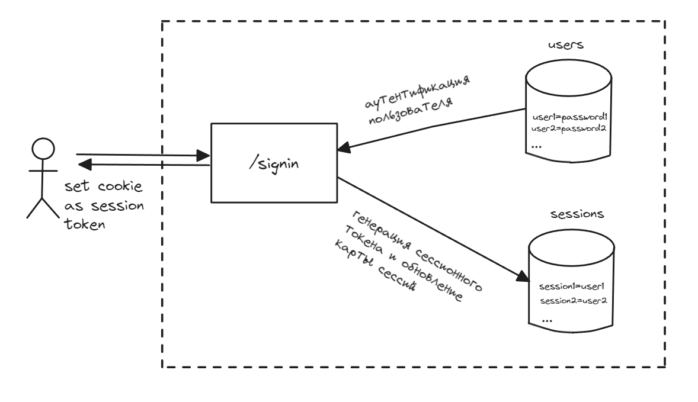
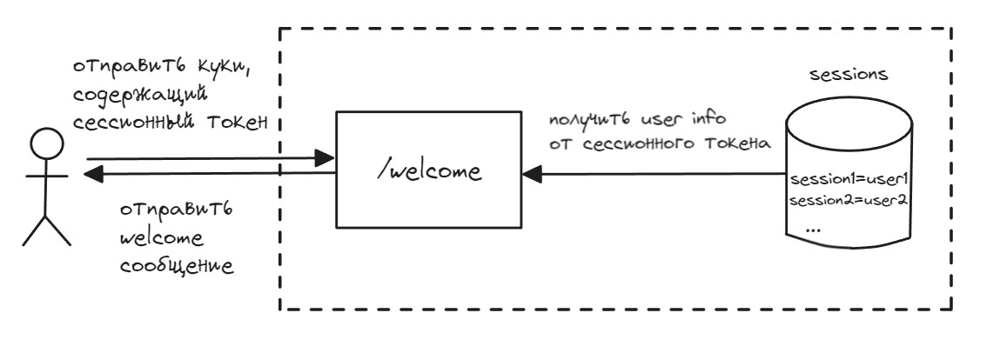
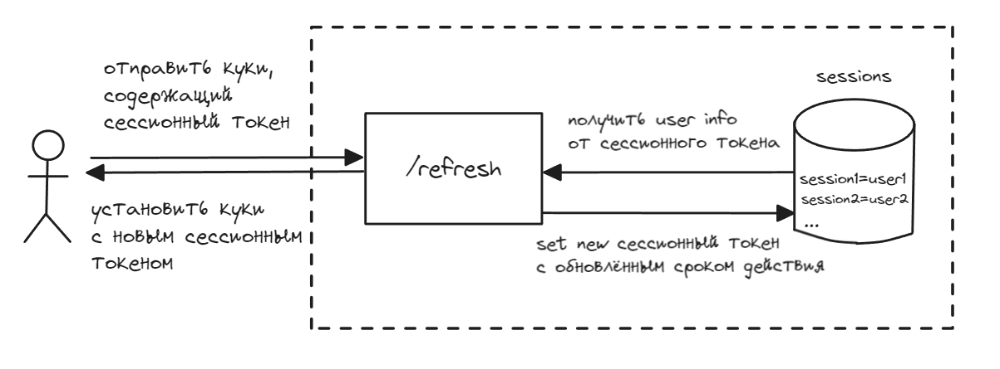
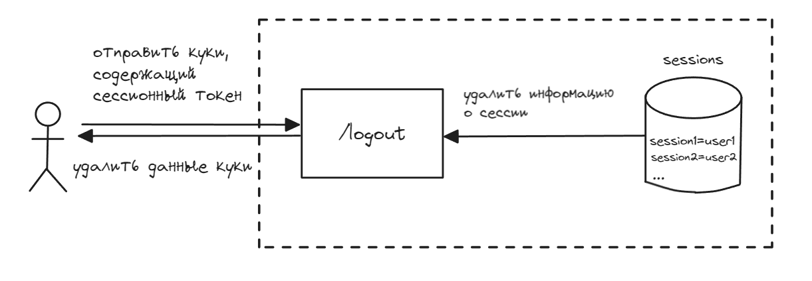

# Создание Server side session аутентификации с сохранением токена в куки клиента

***

1. Склонируйте репозиторий на вашу локальную машину:

   ```bash
   git clone https://github.com/Jhnvlglmlbrt/server-side-session-auth

2. Перейдите в директорию проекта:

   ```bash
   cd server-side-session-auth

3. Установить зависимости:
    
    ```bash
    go get 

4. Запустите код: 

    ```bash
    make run

5. Запросы к ручкам:

    ```bash 
    POST http://localhost:8080/signin

    {"username":"user2","password":"password2"}

    GET http://localhost:8080/welcome

    POST http://localhost:8080/refresh

    GET http://localhost:8080/logout


***
### Структура приложения



Если пользователь успешно входит в систему, этот обработчик установит файл cookie на стороне клиента и в своей локальной памяти. Как только файл cookie установлен на клиенте, он отправляется вместе с каждым последующим запросом.



Теперь, когда информация о сеансе пользователя на его клиенте сохранена (в форме файла session_token cookie) и на сервере, напишем обработчик «приветствия» для обработки информации, специфичной для пользователя.

Из кода мы видим, что наш обработчик приветствия дает нам 401 статус «неавторизованный» (или ) при определенных обстоятельствах:

1. session_tokenЕсли вместе с запросом нет файлов cookie (это означает, что запрашивающая сторона не входила в систему)
2. Если токен сеанса отсутствует в памяти (это означает, что запрашивающая сторона отправляет нам недопустимый токен сеанса)
3. Если срок сеанса истек

Аутентификация на основе сеанса обеспечивает безопасность сеансов ваших пользователей несколькими способами:

1. Поскольку токены сеанса генерируются случайным образом, злоумышленнику практически невозможно взломать сеанс пользователя.
2. Если токен сеанса пользователя каким-либо образом скомпрометирован, его нельзя будет использовать после истечения срока его действия. Вот почему время истечения ограничено небольшими интервалами (от нескольких секунд до пары минут).



Поскольку срок действия токена сеанса остается небольшим, нам необходимо часто выпускать новый токен, чтобы пользователь оставался в системе.

Конечно, нельзя ожидать, что пользователь будет входить в систему каждый раз, когда истечет срок действия его токена. Чтобы решить эту проблему, можно создать другой маршрут, который принимает текущий токен сеанса пользователя и выдает новый токен сеанса с обновленным сроком действия.



Если пользователь решит выйти из нашего приложения, нам необходимо удалить его токен сеанса из нашего хранилища, а также из клиента пользователя.